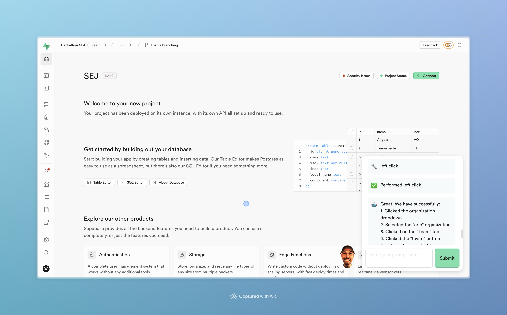
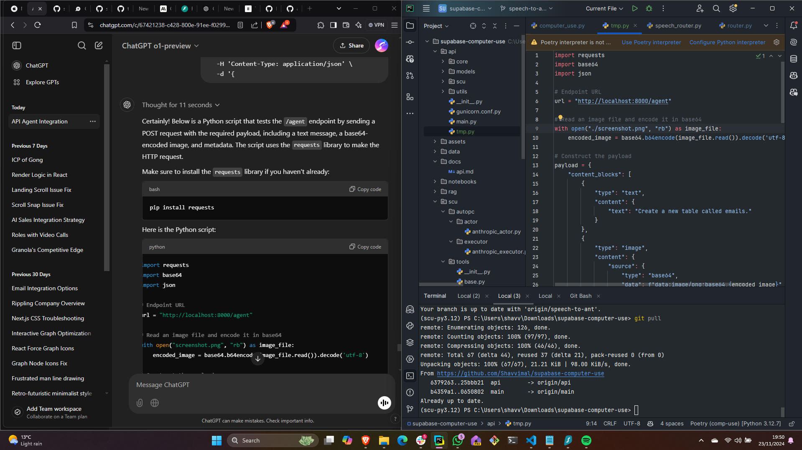

# Supabase Computer Use Agentic Customer Success

Customer Success and FDE's are innundated with questions. Users dont read the docs. How can we automate these tutorials? Our agent hand holds you the entire way, using RAG to fetch the data from the docs, to instruct the user how ot do things. 

## asdas

1. User will ask a Question
2. Agentic RAG for Expansion will:
   - Take in Query
   - See if RAG is required
   - Fetch relevant Documentation using RAG
   - Checks Relevance
   - If not relevant, rewrite the query and retry
   - Generate as detailed instructions for Computer Use to use the GUI






1. Add Anthropic-defined computer use tools to your API request, as well as the user prompt
2. Claude loads the stored computer use tool definitions and assesses if any tools can help with the user’s query.
   - If yes, Claude constructs a properly formatted tool use request.
   - The API response has a `stop_reason` of `tool_use`,
3. On our side, we extract the tool name and input from Claude’s request.
4. Use tool on computer
5. Claude analyzes the tool results to determine if more tool use is needed or the task has been completed.
   - If Claude decides it needs another tool, it responds with another `tool_use` stop_reason and you should return to step 2
   - Otherwise, it crafts a text response to the user.
6. Continue the conversation with a new user message containing a `tool_result` content block.

## API

```bash
uvicorn api.main:app --host 0.0.0.0 --port 8000 --reload
```

## Docker

```bash
docker build -t sammy-api .
```

To run, specifying with our `.env` file:

```bash
docker run sammy-api --env-file <env_file>
```

For me:

```bash
docker rm sammy-api ; docker run --detach --env-file docker.env -p 8000:8000 --name sammy-api sammy-api
```

Complete command:

```bash 
docker build -t sammy-api . ; docker rm sammy-api ; docker run --detach --env-file docker.env -p 8000:8000 --name sammy-api sammy-api
```

# Deploy

```bash
az login --use-device-code
```

```bash
docker build --tag fastapi-demo .
```

To deploy the Docker image to Azure Container Apps, use the az containerapp up command. (The following commands are shown for the Bash shell. Change the continuation character (\) as appropriate for other shells.)

```bash
az containerapp up --resource-group sammy-api --name fastapi-sammy --ingress external --target-port 8000 --location uksouth --source . --env-vars SECRET=SAUCE
```

Stream logs for your container with: 

```bash
az containerapp logs show -n fastapi-sammy -g sammy-api 
```

See full output using:

```bash
az containerapp show -n fastapi-sammy -g sammy-api 
```
